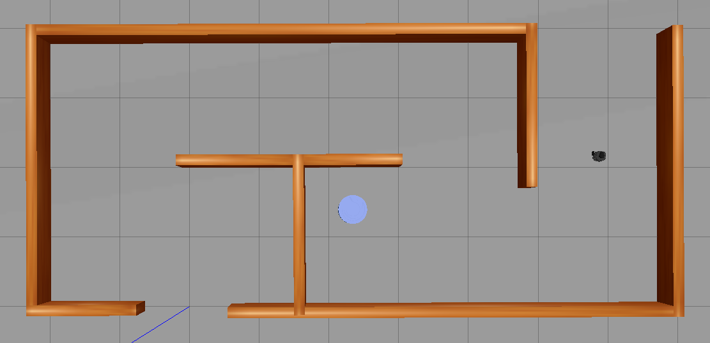
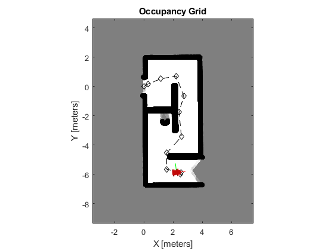
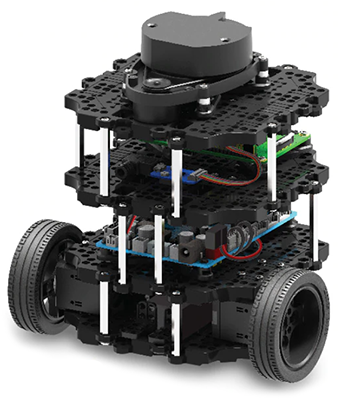
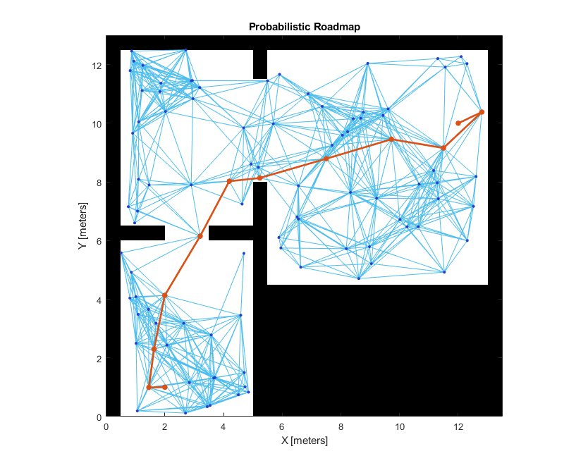

# Mobile-robotics-auto_nav
SLAM (Simultaneous Localization and Mapping)
# Introduction

The goal of this lab project work is to have a deeper knowledge about SLAM (Simultaneous Localization and Mapping). The emphasis on this project is on creating a map of a virtual
simulation of a house using SLAM. We’ve used trutleBot3 model name waffel and gazebo house world to simulate a navigation throughout an office compound. The layout of this report lists questions from the main lab document followed by answer and practical discussions that arises during the lab work.

## Navigate through Map
Using the teleoperater node as a controller, the bot3 managed to move and explore unknown
areas through the compound. The bot3 model is a burger. I was unable to use a
waffel model especially implementing SLAM. One best practice I’ve learned in this task is
to set the source with model/setup.bash eventually avoiding to enter model of the robot
several times.

  
  

  

  

  

## Perform navigation in Gazebo using MAT-LAB

A simple navigation Mat-lab-application is used to navigate through the maze. This is
done using a probabilistic road map developed in prior labs with few modifications inorder
to accommodate obstacle avoidance.The idea behind PRM algorithm is basically, to explore
feasible paths around a number of obstacles located in the map. This could be done
using mobileRobotPRM object in mat-lab. This app requires a start and a goal position
and it then calculates an optimized path towards goal position. The robot movement is
controlled using the defined mat-lab application followed by a map builder using Hectors’
method. The map then exported to mat-lab thorough ros-bag. It’s important to note
that Occupancy-Map is modified to fit the original map recorded in Rvis. This is due
to the color miss-match created when using original occupancy-grid. The result shows
the robot controlled using a simple mat-lab application by publishing twist, message in
cmdvel topics and reading pose and velocity from Odom topic in real-time. Way-points
are defined using the predetermined path created in PRM. Two Matlab-solution is provided
for this task in-which the first one is navigation through Operator node and the
other is automatic navigation with collusion avoidance. The latter is presented above as
figure two:-

# Author
**Solomon G**

## Acknowledgments
Special thanks to resources on https://emanual.robotis.com/docs/en/platform/turtlebot3/overview/, 

## Open Source License Acknowledgement
* Univestiy West - Part of school project

